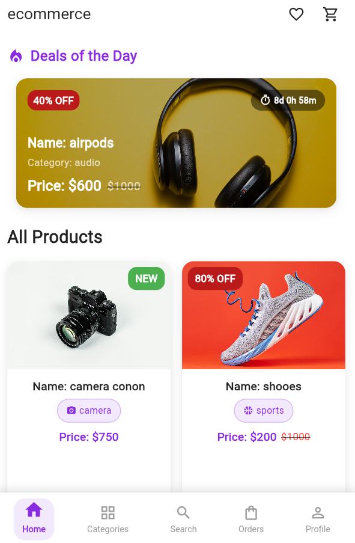

# 🛒 E-Commerce Mobile App

A modern, full-stack e-commerce mobile application built with **Flutter** and **Django REST API**. This project provides a complete shopping experience with user authentication, product management, order processing, and an admin dashboard for business management.

## 📱 Screenshots



## 🚀 Features

### 📱 **Mobile App Features**

- **User Authentication** - Register, Login, Profile Management
- **Product Catalog** - Browse products by categories with search functionality
- **Shopping Cart** - Add/remove items, quantity management
- **Wishlist** - Save favorite products for later
- **Order Management** - Place orders, track order status
- **Product Reviews** - Rate and review products
- **Push Notifications** - Real-time order updates
- **Profile Management** - Update personal info, shipping address, profile picture
- **Modern UI/UX** - Beautiful cards, smooth animations, responsive design

### 🖥️ **Admin Dashboard Features**

- **Product Management** - Add, edit, delete products and categories
- **Order Management** - View, update order status, manage deliveries
- **User Management** - View users, manage accounts
- **Deal Management** - Create time-limited deals and discounts
- **Review Management** - Moderate product reviews
- **Analytics Dashboard** - View sales statistics and insights
- **Notification System** - Send push notifications to users

## 🏗️ Architecture

### **Frontend (Mobile App)**

- **Framework**: Flutter (Dart)
- **State Management**: Provider
- **HTTP Client**: http package
- **Local Storage**: SharedPreferences, FlutterSecureStorage
- **Image Handling**: ImagePicker, CachedNetworkImage
- **UI Components**: Material Design 3

### **Backend (API Server)**

- **Framework**: Django REST Framework (Python)
- **Database**: PostgreSQL
- **Authentication**: JWT (JSON Web Tokens)
- **File Storage**: Django Media Files
- **Push Notifications**: Firebase Cloud Messaging
- **API Documentation**: RESTful API endpoints

## 📄 App Pages & Screens

### 🔐 **Authentication Flow**

- **Splash Screen** - App loading and initialization
- **Onboarding Screen** - Welcome slides for new users
- **Login Screen** - User authentication
- **Register Screen** - New user registration

### 🏠 **Main App Screens**

- **Home Screen** - Featured products, deals, categories
- **Categories Screen** - Product categories grid
- **Product List Screen** - Products by category
- **Product Detail Screen** - Product info, reviews, add to cart
- **Search Screen** - Search products with filters
- **Cart Screen** - Shopping cart management
- **Checkout Screen** - Order placement and payment
- **Orders Screen** - Order history and tracking
- **Wishlist Screen** - Saved favorite products
- **Profile Screen** - User account information
- **Edit Profile Screen** - Update user details
- **Notifications Screen** - Push notifications history

### 🛠️ **Admin Dashboard Pages**

- **Dashboard Home** - Statistics and overview
- **Product Management** - CRUD operations for products
- **Category Management** - Manage product categories
- **Order Management** - Process and track orders
- **User Management** - View and manage users
- **Deal Management** - Create promotional deals
- **Review Management** - Moderate product reviews
- **Notification Center** - Send push notifications

## 🛠️ Installation & Setup

### **Prerequisites**

- Flutter SDK (3.0.0+)
- Python 3.8+
- PostgreSQL
- Firebase Account (for push notifications)

### **Backend Setup (Django)**

1. **Clone the repository**

```bash
git clone <repository-url>
cd ecommerce_app/backend
```

2. **Create virtual environment**

```bash
python -m venv venv
source venv/bin/activate  # On Windows: venv\Scripts\activate
```

3. **Install dependencies**

```bash
pip install django djangorestframework django-cors-headers pillow
pip install djangorestframework-simplejwt psycopg2-binary
```

4. **Database setup**

```bash
python manage.py migrate
python manage.py createsuperuser
```

5. **Run the server**

```bash
python manage.py runserver 192.168.43.216:8000
```

### **Frontend Setup (Flutter)**

1. **Navigate to project root**

```bash
cd ecommerce_app
```

2. **Install dependencies**

```bash
flutter pub get
```

3. **Run the app**

```bash
flutter run
```

## 🌐 API Endpoints

### **Authentication**

- `POST /auth/register/` - User registration
- `POST /auth/login/` - User login
- `PUT /auth/profile/update/` - Update profile
- `POST /auth/token/refresh/` - Refresh JWT token

### **Products**

- `GET /api/products/` - Get all products
- `GET /api/products/{id}/` - Get product details
- `GET /api/categories/` - Get categories
- `GET /api/products/{id}/reviews/` - Get product reviews

### **Shopping**

- `GET /api/cart/` - Get user cart
- `POST /api/cart/add-item/` - Add item to cart
- `POST /api/orders/create/` - Create new order
- `GET /api/orders/list/` - Get user orders

### **Wishlist**

- `GET /api/wishlist/` - Get user wishlist
- `POST /api/wishlist/toggle/{id}/` - Add/remove from wishlist

## 🔧 Configuration

### **Backend Configuration**

Update `backend/ecommerce_backend/settings.py`:

```python
# Database
DATABASES = {
    'default': {
        'ENGINE': 'django.db.backends.postgresql',
        'NAME': 'your_db_name',
        'USER': 'your_db_user',
        'PASSWORD': 'your_db_password',
        'HOST': 'localhost',
        'PORT': '5432',
    }
}

# Firebase (Optional - for push notifications)
FIREBASE_CREDENTIALS = 'path/to/firebase-credentials.json'
```

### **Frontend Configuration**

Update `lib/services/api_service.dart`:

```dart
static String get baseUrl {
  return 'http://YOUR_IP_ADDRESS:8000'; // Replace with your server IP
}
```

## 🚀 Deployment

### **Backend Deployment**

- Deploy Django app to services like Heroku, DigitalOcean, or AWS
- Configure PostgreSQL database
- Set up static file serving
- Configure CORS for mobile app

### **Mobile App Deployment**

- **Android**: Build APK/AAB for Google Play Store
- **iOS**: Build IPA for Apple App Store
- **Web**: Deploy to Firebase Hosting or Netlify

## 🤝 Contributing

1. Fork the repository
2. Create your feature branch (`git checkout -b feature/AmazingFeature`)
3. Commit your changes (`git commit -m 'Add some AmazingFeature'`)
4. Push to the branch (`git push origin feature/AmazingFeature`)
5. Open a Pull Request

## 📝 License

This project is licensed under the MIT License - see the [LICENSE](LICENSE) file for details.

## 👨‍💻 Author

**Your Name**

- GitHub: [@M7Xb](https://github.com/M7Xb)
- Email: mouadloka3@gmail.com

## 🙏 Acknowledgments

- Flutter team for the amazing framework
- Django REST Framework for the robust backend
- Material Design for the beautiful UI components
- Firebase for push notification services

## 📞 Support

If you have any questions or need help with setup, please open an issue or contact the maintainer.

---

⭐ **Star this repository if you found it helpful!**
